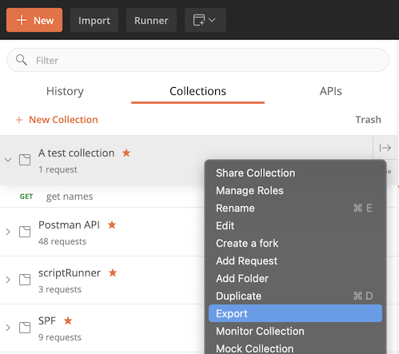
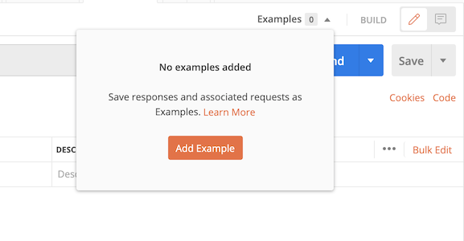
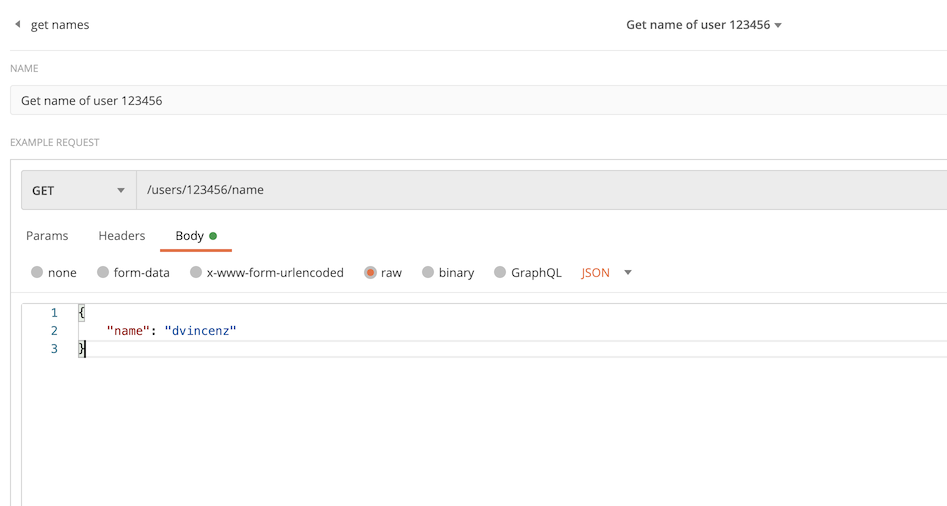

# Postman-mockserver (PMS)
Postman mock server (following called PMS) is a simply console application that starts a server which reads postman collection 
configuration and emulates a mock server. Postman supports all PMS functions and more features with their 
[mock server](https://learning.postman.com/docs/designing-and-developing-your-api/mocking-data/setting-up-mock/).
The official postman service has some limitations that PMS helps you to overcome 
(e.g., number of request, avoid external dependencies, instability etc)

## Modes
You can use this PMS in two different modes, **static** or **online**. In the (default) static mode you will pass a
postman-collection export file. In the online mode you can add a postman api key, and the server will fetch the
postman-collection configuration by itself. In the online mode you can use the postman webhooks to be notified when a 
collection in your postman UI has been changed.


## Quickstart (Docker)
To quickstart we recommend using the pre build docker container. If you prefer to use PMS without docker you will
find the needed instructions at the [Native](#native) section. You can find the docker on 
[dockerhub](https://hub.docker.com/repository/docker/dumeni/postman-mockserver)

### Static mode
The static mode serves a postman-export file ([how to get this file](#get-postman-collection-export-file)). 
Run the PMS-docker container with the following command
```docker run -v /path/to/postman/collection/export.json:/app/config/collection.json -p 8080:8080 postman-mockserver:latest```.
You should see that PMS is starting to listen on port 8080. The PMS logs (in trace log mode)
all configured mocks in the console output. If you can't see any mocks please make sure you have 
added mocks in your [collection](#add-mocks-in-postman-ui).

In the [static section]() you can find more possible parameters or configurations for the static mode. To override the
config file simply mount a yaml file into `````/app/config/config.yaml````` of the docker container.

### Online mode
The online mode is the best choice if you want to continuously update your postman collection on your PMS 
and always access the newest mocks. For the online mode you need to [get](#get-postman-api-token) an API key from postman.

Use this command to start the docker container in the online mode: 
``````docker run -p 8080:8080 postman-mockserver:latest "online -t <your token>"``````

If you like to get notified when the postman collection has been updated through your postman UI you need to configure a 
[webhook](#register-postman-webhook). Otherwise, you need to restart your PMS each time postman has been updated 
to fetch the newest mocks from the postman server.

## Native ###
You can also use the PMS natively without docker. Right now we do not provide compiled sources, so you need
to compile it by your own.
1. [install golang](https://golang.org/doc/install)
2. clone this repo ```git clone https://github.com/dvincenz/postman-mock.git```
3. change to the projects directory ````cd postman-mock````
3. type ``` go build . -o postman-mockserver ```
4. run the postman mock server with ```postman-mockserver static``` or ```postman-mockserver online```
    - for the [online](#online) mode you need at least an api token, for the [static](#online) mode you need at least a postman export file


## PMS configuration
All of the configuration settings can be specified either in the configuration file 
or in an environment variable. The environment variable overrides the equivalent option in the configuration file.
Some configuration parameters can also be defined as start parameters. The start parameters will override configuration
file as well as the environment variables.

### Environment Variable
The PMS environment variables are documented in the [config](./config.yaml) file. All of the PMS-specific environment variables 
are prefixed with PMS_. The environment variables need to be written in capital letters. 
The structure of the yaml file is represented by a ```_``` character. For example to set the postman api token
 just set the following environment variable ```PMS_POSTMAN_TOKEN=<your token>```.


### Start parameters

#### global
To start the PMS you need to choose a mode with either ```postman-mockserver static``` or ```postman-mockserver ònline```. 
The static mode is the default mode. The following configurations are valid for both modes.

```--help``` you can find more information for all parameters.

```--config``` PMS will lookup a config file in ```$HOME/.pms/config.yaml``` if you like to override the default path you can do
as shown in the following example: ````postman-mockserver static --config /path/to/your/config.yaml````. 

```--port``` Change the default binding parameter. In case you use docker, make sure you expose the same port on 
docker as you bind in your PMS instance.

### static
```--path``` Set the path to the collection file from your postman export.

### online
```--token``` Set postman api token


## Postman configuration ##
In this section we try to provide the needed help to configure your postman. Please note that some of the print screens
or even descriptions in this documentation may differ from the postman because postman can change their systems at any time.

### Get postman-collection export file
This file is needed for a static mode of the mockserver. You can export the file in the postman client:



### Add mocks in postman UI
You need to add some mocks over the postman UI because without mocks (also known as **examples** in postman UI) the PMS 
does not know what it should return on a request.



In the mock path you should only write the path that you intend to request, without hostname/servername. 



- At the moment only 1:1 URL matching is supported. Variables e.g ```{{customerId}}``` are not supported. 
- The postman matching roles 
described [here](https://learning.postman.com/docs/postman/mock-servers/matching-algorithm/) are also not supported right now.
- the HTTP verb is considered.


### Get Postman API Token
You can get a new token to access postman integration api [here](https://go.postman.co/integrations/services/pm_pro_api).
You need this token for the startup in the online mode.

### Register postman webhook
postman documentation [webhook](https://learning.postman.com/docs/integrations/webhooks/)
- todo: add description how to use webhooks

### Register postman webhook for local use
- todo

